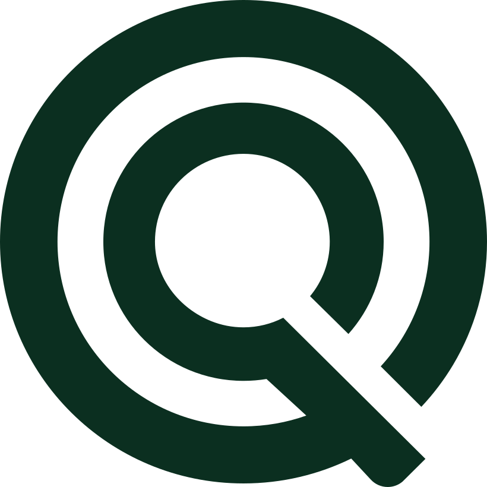
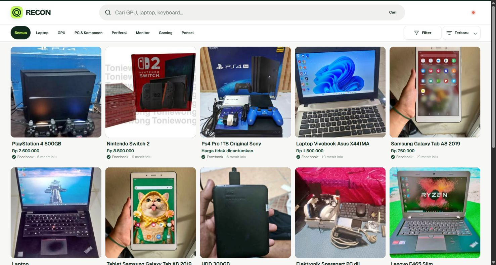
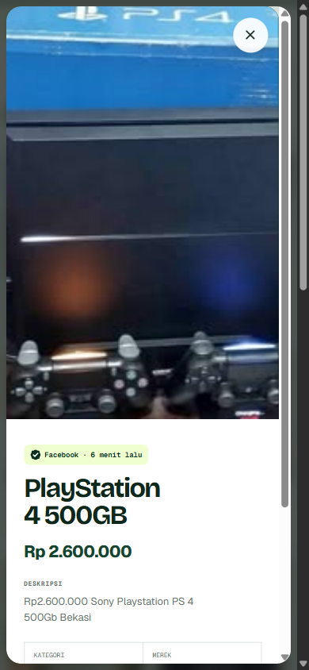

<p align="center">
  
</p>

<p align="center">
  A public discovery feed for second-hand computers, parts, gaming gear, and tech in Indonesia.
</p>

<p align="center">
  <a href="https://recon.app-pixel.com">Open RECON</a>
</p>



## What RECON does

RECON collects public listings from multiple sources and presents them in one clean, searchable feed. Listings are normalized into consistent categories, prices, conditions, locations, and availability, with a direct link back to the original post.

- Browse all discoveries in one place.
- Search and filter by collection, platform, price, status, condition, or location.
- Open a listing to see its images and important details.
- Continue to the original source when something looks interesting.



## Sources

RECON currently discovers public listings from Facebook Marketplace, Instagram, and Reddit.

## Stack

- Next.js, tRPC, Prisma, and PostgreSQL
- Python collectors and a queued AI normalization pipeline
- Docker Compose, GitHub Actions, and Docker Hub

## Local development

```powershell
npm install
npm run db:generate
npm run db:smoke
python -m unittest discover scraper.tests
npm run check
npm run build
```

Use Docker Compose for local PostgreSQL. Keep real secrets in the ignored `.env` files.

The scheduled scraper runtime is split into a collector, an AI manager, and an Instagram media worker. See the project `AGENTS.md` and scraper override notes for the current operational contract.
