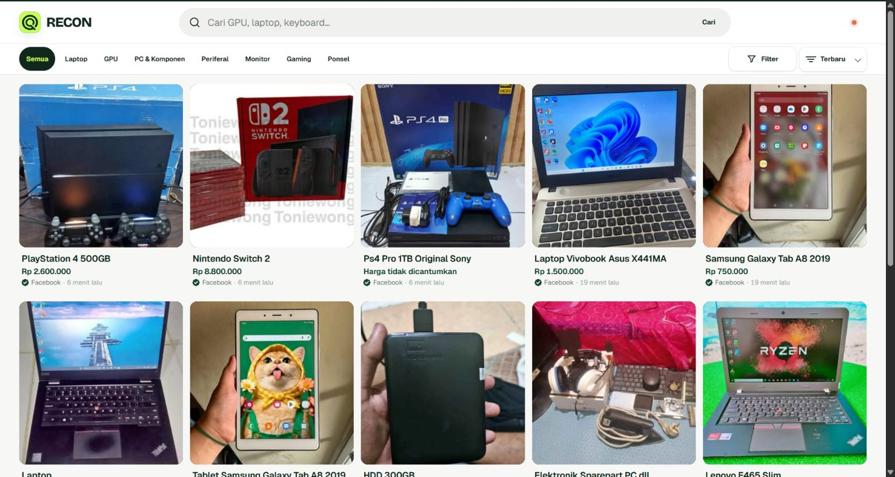

<p align="center">
  
</p>

<p align="center">
  A public discovery feed for second-hand computers, parts, gaming gear, and tech in Indonesia.
</p>

<p align="center">
  <a href="https://recon.app-pixel.com">Open RECON</a>
</p>



## What RECON does

RECON collects public listings from multiple sources and presents them in one clean, searchable feed. Listings are normalized into consistent categories, prices, conditions, locations, and availability, with a direct link back to the original post.

- Browse all discoveries in one place.
- Search and filter by collection, platform, price, status, condition, or location.
- Open a listing to see its images and important details.
- Continue to the original source when something looks interesting.

## Sources

RECON currently discovers public listings from Facebook Marketplace, Facebook Groups, Instagram, and Reddit.

## Stack

- Next.js, tRPC, Prisma, and PostgreSQL
- Python collectors and a queued AI normalization pipeline
- Docker Compose, GitHub Actions, and Docker Hub

## Local development

```powershell
npm install
npm run db:generate
npm run db:smoke
python -m unittest discover scraper.tests
npm run check
npm run build
```

Use Docker Compose for local PostgreSQL. Keep real secrets in the ignored `.env` files.

## Self-host with Docker Compose

Requirements: Docker with Compose, a public or local port for the web app, and outbound internet access for the scrapers.

```powershell
Copy-Item .env.example .env
docker compose up -d --build postgres web
docker compose exec web npx prisma migrate deploy
```

Before starting, edit `.env`:

- Replace `POSTGRES_PASSWORD` and keep the same database name, user, and password in `DATABASE_URL`.
- Set `NVIDIA_API_KEY` to enable AI normalization.
- Set all five `R2_*` values to enable the media worker and copy Instagram, Facebook Group, and Reddit images to Cloudflare R2.
- Keep `SCRAPER_EGRESS_MODE=direct` unless you intentionally configure and allow a proxy or VPN.

Open `http://localhost:3000`. To run the scheduled scraper pipeline:

```powershell
docker compose up -d --build scraper-scheduler scraper-ai-manager
docker compose ps
docker compose logs -f scraper-scheduler scraper-ai-manager
```

After configuring R2, also start `scraper-media-worker`. The scheduler collects listings, the AI manager normalizes and writes them to PostgreSQL, and the optional media worker caches Instagram, Facebook Group, and Reddit images. Edit accounts, source enablement, limits, and schedules in `scraper/config/sources.toml`; edit Marketplace searches in `scraper/facebook/source_targets.json` and Group targets in `scraper/facebook_groups/source_targets.json`. Never put API keys, cookies, or passwords in those tracked files.

## License

RECON is available under the [MIT License](./LICENSE).
