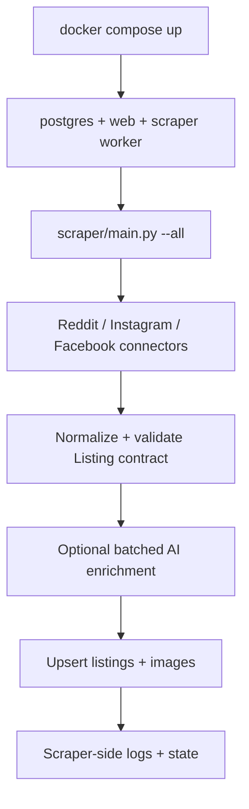

# Scraper Service Context

This folder is the Python scraper service boundary for RECON.

Keep scraper-specific source URLs, cadence, user-agent, retry, and platform configuration here instead of in the root T3 web app env files.

The existing platform folders are proof collectors until the normalized listing contract and ingestion path are implemented.

## Phase 2 Reddit Recap For Other Connectors

Reddit is the current reference connector shape:

1. Collect source data with the safest available public endpoint.
2. Normalize into the Prisma listing contract, not a source-specific shape.
3. Keep raw seller text in `description`; only extract fields that exist in the database.
4. Use batched AI parsing only as an enrichment layer for messy text, with rule parsing as fallback.
5. Emit nested `images` as `sourceUrl`, `position`, and `altText`; fetch all gallery images when the source exposes them, but degrade to available thumbnails when blocked.
6. Keep platform rate limits, cooldowns, locks, and fetch notes in the platform folder.

Instagram and Facebook should reuse the same parser contract and AI enrichment pattern instead of inventing separate output schemas.

## Phase 2 Instagram Recap For Facebook

Instagram confirmed the shared connector shape still holds, but it also exposed source-specific traps that Facebook should account for:

1. The source list must be explicit and reviewed. The current Instagram sources are `chemicy.consignment`, `thelazytitip`, `sensegame.id`, `cappee.gaming`, `gamecentral.id`, `consigngaming`, and `ggsconsign`; remove stale source names instead of silently ignoring them.
2. Fetching and parsing are separate decisions. Instagram profile data could be inspected through anonymous Chrome diagnostics, while direct anonymous requests may return `429`; future Facebook work should first prove the safest fetch source before adding parser/storage behavior.
3. Never trust returned order blindly. Instagram profiles can surface pinned or stale posts before newer posts, so connectors should sort by source timestamp and then classify content vs product posts.
4. Keep raw source text in `description`, then map only database-backed fields into the normalized listing shape. Do not emit parser-only evidence, confidence, OCR notes, or model-specific fields into normal listing JSON until the schema explicitly changes.
5. Availability reconciliation should use deterministic source-specific markers when available. For Instagram examples, `thelazytitip` uses `SOLD`, `consigngaming` uses `SOLDOUT`, and `gamecentral.id` uses `SOLD OUT`; AI is not needed for these status updates.
6. For removed or unavailable posts, do not guess sold status. Log the degraded fetch or missing-post check in scraper-side state, then keep the current listing status until a source-specific rule is approved.
7. Runtime diagnostics such as `.codex-runtime/instagram-latest-normalized-local.json` are local evidence only. Do not commit browser cookies, CSRF tokens, captured headers, or unsanitized source snapshots.

Facebook should inherit the same public-source posture: prove access first, keep run health and cooldowns scraper-side, normalize into `listings`/`listing_images`, and degrade gracefully when the source blocks, gates, removes, or reorders content.

## Phase 2 Facebook Recap For Future Scraper Work

Facebook Marketplace is now a hardened diagnostic connector, but it remains outside database ingestion until the ingestion path is explicitly approved.

Current useful commands:

```powershell
python "scraper\facebook\facebook_marketplace.py" --list-targets
python "scraper\facebook\facebook_marketplace.py" --once --target gpu-rtx --limit 5 --headless --format json --no-state
python "scraper\facebook\facebook_marketplace.py" --once --target gpu-rtx --limit 5 --details --ai-parse --format json --no-state
python "scraper\facebook\facebook_marketplace.py" --watch --interval 60 --target-group hot --headless --details --ai-parse
python "scraper\facebook\facebook_marketplace.py" --calibrate-targets --target gpu-rtx --target laptop-gaming --format json --no-state
python "scraper\facebook\facebook_marketplace.py" --access-mode http-probe --target gpu-rtx --no-state
```

Important Facebook-specific facts:

1. Plain HTTP/requests access is not reliable. The direct probe returned HTTP 400/no item cards; keep it as a diagnostic only, not the collection strategy.
2. The practical path is Playwright with a persistent local profile. It can run headless after session setup; first-time setup may need `--login` with a visible browser. Do not commit `.facebook-profile*`.
3. Reviewed Marketplace targets live in `scraper/facebook/source_targets.json`. This is scraper-side config, not PostgreSQL. Do not reintroduce `source_targets`, `scrape_runs`, or connector health tables into the Phase 1 database.
4. Use target groups instead of broad Electronics search. `hot` is minute-level diagnostic coverage; `parts` and `peripherals` should run slower; `discovery` is broad radar only and should not be promoted without calibration evidence.
5. `--calibrate-targets` is the safe way to judge a query before adding it to a faster cadence. It reports candidate, matched, skipped, blocked, and sample title counts without updating seen IDs.
6. The connector emits the shared listing shape only: `platform`, `sourceUrl`, `externalId`, `title`, `description`, `category`, `brand`, `price`, `locationTexts`, `conditionText`, `sellerName`, `status`, `postedAt`, `firstFetchedAt`, `lastFetchedAt`, and nested `images`.
7. NVIDIA AI parsing is optional with `--ai-parse`; it must stay batched and limited to database-backed fields. Rule parsing remains the fallback. Use `--ai-prefer` carefully because model output can be worse than browser/rule fields.
8. Detail pages are expensive and more likely to expose gating. With state enabled, `--details` fetches details only for new listings by default; use `--detail-scope all` only for controlled debugging.
9. Runtime state and logs are local-only: `scraper/.state/facebook_marketplace.json`, `scraper/.state/facebook_marketplace.lock`, and `scraper/.logs/facebook_marketplace.jsonl`.
10. Parser fixes already handled: broad `switch` was removed, CLI `--limit` now overrides target defaults, low-value titles such as `·` fall back to image alt text, card-location blobs containing prices are dropped, `Bekasi` no longer becomes condition text, and ROG/Zephyrus/Victus/Nitro style laptop titles classify as `Laptop`.
11. Do not add login-wall bypass, CAPTCHA solving, account rotation, proxy escalation, seller messaging, form submission, or account-side actions. Prefer cooldowns, degraded state, and explicit approval before changing access strategy.

Latest verification before this note: Python compile passed, JSON target config validated, `ruff` passed for scraper files, `npm run check` passed, headless Facebook fetch returned live listing JSON, and `npm audit --omit=dev` still only showed the known existing `next -> postcss` advisory.

## Phase 2 Orchestrator And Shared Contract

The scraper root now has a read-only orchestrator:

```powershell
python -m scraper.main --all --limit 1 --no-state --headless
python -m scraper.main --reddit --format json
python -m scraper.main --instagram --instagram-account chemicy.consignment
python -m scraper.main --facebook --facebook-target gpu-rtx --headless
```

Important behavior:

1. `scraper/main.py` stays read-only by default. It only writes to PostgreSQL when called with `--write-db`.
2. Source settings live in `scraper/config/sources.toml`. Keep public URLs, account names, source target references, cadence hints, and safe connector defaults there. Do not put cookies, tokens, or secrets in the config.
3. `scraper/shared/listing_contract.py` is the shared Prisma-facing output gate. Connector output must validate before the orchestrator reports success.
4. Reddit remains RSS-first. The orchestrator default is `image_mode = "rss"` to avoid detail JSON `403`/`429` during cross-platform checks.
5. Instagram now has `scraper/instagram/instagram.py`, which uses the public `web_profile_info` path with browser-like public headers. It sorts posts by timestamp, skips obvious non-listing content, and reports per-account HTTP status. If Instagram returns `429` or blocks, report it honestly; do not add captured session headers or cookies.
6. Facebook still runs through Playwright and a persistent local profile. A browser-based success does not always expose a useful single HTTP status, so judge it by card exposure, normalized listing count, and validation errors.
7. The first successful all-connector read-only check was:

```powershell
python -m scraper.main --all --limit 1 --no-state --headless > .codex-runtime\phase2-main-test.json
```

That run produced 9 validated listings across Reddit, Instagram, and Facebook with no validation errors and no database writes.

## Phase 2 Latest Parser Footnote

The Instagram connector and AI enrichment path were rechecked after the shared orchestrator landed:

```powershell
python -m py_compile scraper\main.py scraper\instagram\instagram.py scraper\reddit\nvidia_parser.py
python -m ruff check scraper
python -m scraper.main --instagram --limit 1 --no-state --ai-parse > .codex-runtime\instagram-ai-parse-check-2.json
```

That run returned HTTP 200 for all 7 configured Instagram accounts, validated 7 normalized listings, and applied NVIDIA AI parsing successfully with `aiParse.applied = true`. The sample output had populated `category`/`brand` for product-supported rows such as Desktop PC/AMD, Motherboard/Gigabyte, Audio/Sony, Game/Square Enix, GPU/Razer, and Peripheral/Moza. Keep `brand = null` when the source text does not identify a product manufacturer, such as generic headset posts.

Instagram does not require a browser in the current orchestrator path; it uses the public `web_profile_info` endpoint with browser-like headers. Facebook is different: direct HTTP probing was not reliable, so the current practical connector still uses Playwright and a persistent local profile, preferably headless on server after first session setup. Do not collapse those two access models into one assumption.

One related parser bug was also fixed: Instagram status detection now checks source-specific sold markers near the listing header instead of scanning all footer/marketing text, so phrases like trusted-source sold history should not mark an available listing as `SOLD`.

## Intended Production Scrape Workflow

This is the target runtime shape. The root web image still excludes `scraper/`, so scraper execution uses the separate `scraper/Dockerfile` and the profile-gated Compose service.

Keep the production flow small:



Expected behavior now that the upsert/logging layer exists:

1. `docker compose up` starts PostgreSQL and the web app. `docker compose --profile scraper run --rm scraper` starts the scraper worker after PostgreSQL is healthy.
2. The scraper worker loads `scraper/config/sources.toml`, runs all enabled connectors, and respects platform-specific cooldown/state files.
3. Each connector returns normalized listing JSON only; validation happens before any database write.
4. AI parsing stays optional, batched, and limited to fields that exist on `listings` or `listing_images`.
5. Database writes are idempotent by `sourceUrl`: update existing listings, insert new listings, and reconcile images without creating duplicate listing rows.
6. Run status, connector errors, rate-limit notes, and last-seen cursors stay in scraper-side `.logs/` and `.state/` first, not PostgreSQL.
7. For production, prefer a controlled worker loop with a configured interval, or a one-shot job triggered by cron. Do not rely on a crash/restart loop to schedule scraping because that can hammer source platforms.

## Phase 2 Upsert And Run Logging Implementation

The scraper storage layer is now in `scraper/storage/`.

Important behavior:

1. `scraper/storage/postgres.py` uses parameterized PostgreSQL writes through `psycopg`; no raw SQL string concatenation with listing values.
2. Database URL resolution prefers `--database-url`, then `SCRAPER_DATABASE_URL`, then `DATABASE_URL`. Logs redact passwords before writing or printing storage details.
3. Upserts are idempotent by `listings.source_url`. Existing rows keep their original `first_fetched_at`; later runs update scraper-backed fields and `last_fetched_at`.
4. `listing_images` are reconciled inside the same transaction by deleting old rows for the listing and inserting the current normalized image set. Image identity is internal; `listing_id + position` remains the uniqueness rule.
5. `scraper/storage/run_log.py` writes orchestrator JSONL run records without listing payloads. Default path is `scraper/.logs/scraper_runs.jsonl`; `--no-state` disables this log.
6. The scraper container is intentionally behind the Compose `scraper` profile so normal local `docker compose up` does not start live scraping by accident.

Useful commands:

```powershell
python -m scraper.main --reddit --limit 1 --write-db
python -m scraper.main --all --write-db --headless --facebook-browser chromium
docker compose --profile scraper run --rm scraper
python -m unittest discover scraper.tests
python -m ruff check scraper
```

## Phase 2 Runtime Guardrails

The remaining Phase 2 scraper guardrails are implemented as a minimal runtime layer, not as new database tables.

Important behavior:

1. `scraper/shared/runtime.py` owns the shared `FileLock`, cooldown helpers, retry/backoff helpers, and explicit egress config parsing.
2. `scraper/main.py` takes an orchestrator lock for stateful `--all`, default all-connector runs, and `--write-db` runs. Single-connector read-only orchestrator runs are not globally locked, and `--no-state` bypasses the lock for diagnostics.
3. Reddit and Facebook keep their existing connector-local state, locks, and cooldowns. Reddit now adds configured jitter to its existing 429 retry waits.
4. Instagram now uses bounded retries with jitter around public profile requests and stores cooldown state in `scraper/.state/instagram_accounts.json` when accounts return rate-limit or block statuses.
5. Egress defaults to direct access. Proxy mode requires `SCRAPER_EGRESS_MODE=proxy`, `SCRAPER_ALLOW_PROXY=true`, and `SCRAPER_PROXY_URL`. VPN mode requires `SCRAPER_EGRESS_MODE=vpn` and `SCRAPER_ALLOW_VPN=true`; actual VPN routing is deployment/network setup, not automatic rotation in Python.
6. Proxy URLs may contain credentials, so keep them only in ignored env files or secret stores. Runtime logs redact proxy credentials.
7. Do not add proxy rotation, account rotation, CAPTCHA solving, or automatic VPN switching as a follow-up to blocks. Prefer lower cadence, cooldowns, source-specific fixes, and degraded state first.
