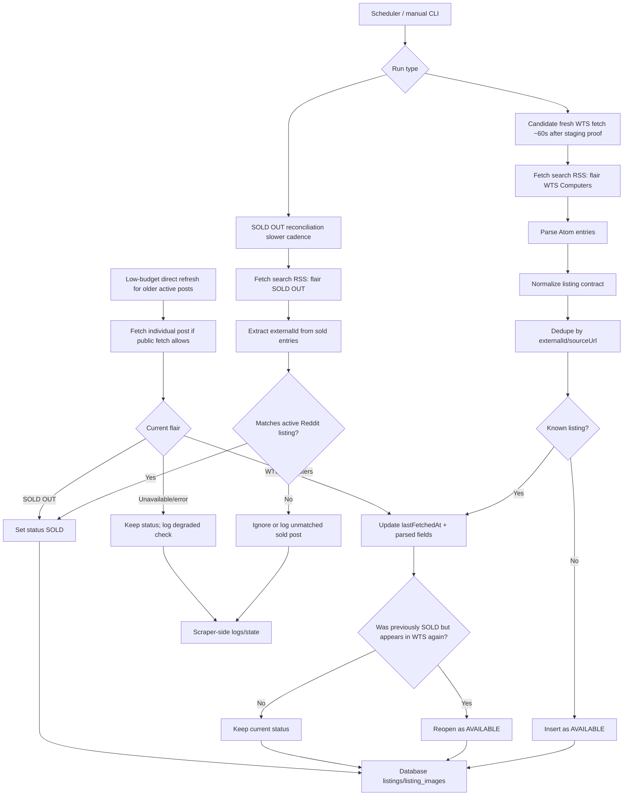

# Reddit Data Collection Notes

Scope: this folder is only for the Reddit collector for RECON. Keep it focused on public seller/listing posts for computer, PC, tech, and gaming peripheral products.

Current script:

```powershell
python "scraper\reddit\reddit.py" --limit 5
```

Current hardened script examples:

```powershell
# Fetch latest posts and print normalized text output.
python "scraper\reddit\reddit.py" --once --limit 15

# Fetch without touching state/log files, useful for quick live checks.
python "scraper\reddit\reddit.py" --once --limit 10 --no-state --format json

# Fetch and enrich parser fields with NVIDIA AI. This still uses rule parsing as fallback.
python "scraper\reddit\reddit.py" --once --limit 10 --no-state --format json --ai-parse

# Force RSS-only image extraction if Reddit detail endpoints are rate-limiting.
python "scraper\reddit\reddit.py" --once --limit 10 --no-state --format json --image-mode rss

# Minute-level watcher. Watch mode prints only unseen posts by default.
python "scraper\reddit\reddit.py" --watch --interval 60 --limit 15

# Same watcher, but force all fetched posts to print each cycle.
python "scraper\reddit\reddit.py" --watch --interval 60 --limit 15 --emit all
```

Important context:

- Target source is `r/jualbeliindonesia`.
- Current target flair is `WTS: Computers & Peripherals`.
- Direct Reddit JSON endpoints returned `403` during probing. On 2026-07-06, `search.json` and `new.json` still returned `403` from this environment with a polite user-agent. The working path is Reddit search RSS/Atom with `sort=new`.
- The RSS body exposes the post description, not just the title.
- Keep a polite `User-Agent`, retry on `429`, and avoid aggressive polling.
- Do not add database write behavior here unless the user asks for it. Phase 1 database scope is still only `listings` and `listing_images`; scraper run logs and connector health stay in scraper-side files.
- Future orchestration should call this script/module separately from Instagram and Facebook.

## Phase 2 Reddit Hardening Notes

What changed:

- `reddit.py` now normalizes RSS entries into the current Prisma-facing listing shape: `platform`, `sourceUrl`, `externalId`, `title`, `description`, `category`, `brand`, `price`, `locationTexts`, `conditionText`, `sellerName`, `status`, `postedAt`, `firstFetchedAt`, `lastFetchedAt`, and `images`.
- The script keeps local scraper state in `scraper/.state/reddit_wts_computers.json` and run logs in `scraper/.logs/reddit_wts_computers.jsonl`; both folders are gitignored.
- A lock file at `scraper/.state/reddit_wts_computers.lock` prevents duplicate local runs. Stale locks older than the CLI threshold are removed.
- Watch mode supports near-minute checks with `--watch --interval 60`, jitter, state-based unseen detection, and cooldown handling. This is code support, not proof that Reddit will tolerate continuous one-minute polling.
- Output formats are `text`, `json`, and `jsonl`. Use `--no-state` for one-off checks that should not mutate local state.
- Image extraction defaults to `--image-mode auto`: the RSS image is always used as a fallback, and the scraper tries Reddit post JSON for full gallery/carousel images. When state is enabled, detail-image fetching defaults to `--image-detail-scope new` so already-seen posts do not get extra per-post requests every minute.

Observed limit behavior:

- A quick repeated RSS/header probe after a successful fetch hit HTTP `429`. Treat this as evidence that burst testing is unsafe.
- During the 2026-07-06 hardening pass, one live `--no-state --format json --limit 3` fetch succeeded, and an immediate follow-up live check returned `429`. Stop live probing after that instead of retrying manually.
- Fresh fetch every minute is not yet operationally proven. Prove it with a controlled staging run after cooldown, for example `--watch --interval 60 --max-iterations 10`, then inspect `scraper/.logs/reddit_wts_computers.jsonl` for `success`, `rate_limited`, and `cooldown_skip` events before increasing duration.
- If Reddit returns final `429`, the script writes `cooldown_until` to state and skips later runs until the cooldown expires unless `--ignore-cooldown` is passed.
- Do not use VPN/proxy rotation to hide bad cadence. First fix cadence, request count, retry behavior, and cooldowns.

Image detail behavior:

- Reddit search RSS often exposes only one `preview.redd.it` thumbnail even when the post has a carousel/gallery.
- Full gallery extraction needs the individual post JSON metadata (`gallery_data` plus `media_metadata`). Reddit currently returns `403` for normal JSON endpoints from this environment and sometimes serves a browser verification page for post HTML, so the script must degrade gracefully.
- Keep `--image-mode auto` for normal runs. It attempts detail metadata once and stops detail probing for that run if the endpoint is blocked, preserving RSS images instead of hammering Reddit.
- Use `--image-mode detail` only for controlled debugging when you explicitly want per-post detail attempts and can tolerate failures.
- Use `--image-mode rss` when Reddit is cooling down or when testing parser fields without image-gallery enrichment.

Parser context:

- Price extraction currently handles common Indonesian seller formats such as `Rp12.000.000`, `Rp. 9.500.000`, `9.6jt`, `3.5 Juta`, `Rp350.000`, and seller typo lines like `3.700.000 jt`.
- Ambiguous tiny shorthand values should remain unparsed until a later parser decision. The database still has only one nullable integer `price` field and assumes IDR.
- Status defaults to `AVAILABLE` for WTS posts unless sold markers such as `sold`, `sold out`, `terjual`, `laku`, or `booked` appear.
- Condition extraction prefers body text before title text so title words like `Fullset Garansi` do not override actual condition lines.
- Location extraction is heuristic: explicit `Lokasi`, `COD`, and known Indonesian city names are preferred. Locations are stored as `locationTexts` arrays because posts can mention multiple public areas such as `Jakpus Jakbar`.
- AI extraction is opt-in through `--ai-parse`. It batches listings, calls NVIDIA NIM, and merges only database-backed listing fields into the normalized output while keeping the rule parser as fallback.
- Do not emit AI-only fields such as product model, CPU, GPU, RAM, warranty, evidence, or confidence in the normal listing JSON. Keep those details in the original `description` unless the database plan explicitly adds columns later.

AI parser context:

- NVIDIA API Catalog/NIM is used through the OpenAI-compatible hosted base URL `https://integrate.api.nvidia.com/v1`.
- Current default model is `nvidia/nemotron-3-nano-30b-a3b`. It is still a free endpoint from the supplied model list, and it parsed shorthand prices like `270K` more reliably than the smaller `nvidia/nemotron-mini-4b-instruct` in the first live parser check.
- The AI parser schema currently returns only `externalId`, `price`, `locationTexts`, `conditionText`, `status`, `category`, and `brand`. `externalId` is used for matching the AI result back to the source listing.
- Required env vars:
  - `NVIDIA_API_KEY`
  - `NVIDIA_API_BASE_URL`, defaults to `https://integrate.api.nvidia.com/v1`
  - `NVIDIA_PARSE_MODEL`, defaults to `nvidia/nemotron-3-nano-30b-a3b`
- The parser uses NVIDIA `nvext.guided_json` when accepted, then falls back to normal JSON-only prompting if that model/endpoint rejects guided JSON.
- Default merge behavior fills missing/unknown rule-parser fields only. Use `--ai-prefer` when AI should override rule-parser values.
- Keep batches small. Default is `--ai-batch-size 5` and `--ai-rate-limit 2.0`, which stays below a 40 RPM account limit.
- Never call AI once per listing in a loop without batching.
- Do not write API keys into tracked files or logs. If a key is exposed in chat or logs, rotate it.

Tests:

- The temporary `scraper/tests/` unit test folder was removed at user request during cleanup. Use compile checks and careful live no-state probes until parser fixtures are reintroduced.

Verification command after cleanup:

```powershell
python -m py_compile "scraper\reddit\reddit.py"
```

## Reddit Workflow

The Reddit connector should run as two related workflows: fresh listing discovery and sold-status reconciliation. Do not treat absence from the WTS feed as sold.

### Fresh Listing Discovery

1. Fetch `r/jualbeliindonesia` search RSS for flair `WTS: Computers & Peripherals` with `sort=new`.
2. Parse RSS entries into normalized listing objects.
3. Use Reddit comment ID as `externalId` and permalink as `sourceUrl`.
4. Dedupe by `externalId` first, then `sourceUrl`.
5. Upsert into `listings` when database ingestion is wired:
   - New `externalId` or `sourceUrl`: insert listing.
   - Existing active listing: update `lastFetchedAt`, mutable parsed fields, images if needed.
   - If a previously sold post appears again in the WTS feed, treat that as a reopen signal and set `status = AVAILABLE`.
6. Keep run logs, cooldowns, and seen IDs in scraper-side files, not PostgreSQL, unless the database plan changes.

### Sold-Status Reconciliation

Reddit sellers can mark a post sold with `!sold`; the subreddit automation changes the flair to `SOLD OUT`. That flair change is the core sold signal.

Preferred logic:

1. Keep `externalId` for every Reddit listing. This is the stable matching key.
2. On the minute-level WTS fetch, only mark posts from the WTS flair as `AVAILABLE` or keep their current parsed status. This path discovers and refreshes available listings.
3. On a slower cadence, fetch a separate Reddit RSS search for flair `SOLD OUT`.
4. For each SOLD OUT entry, extract the same `externalId`.
5. If that `externalId` exists in local active Reddit listings, update that row to `status = SOLD`.
6. For old active listings that might not appear in the newest SOLD OUT feed, run a low-budget direct status refresh later:
   - Select active Reddit listings that have not been status-checked recently.
   - Fetch the individual public post page/feed if Reddit allows it.
   - Parse current flair.
   - If current flair is `SOLD OUT`, update to `SOLD`.
   - If current flair is still WTS, keep `AVAILABLE`.
   - If fetch fails, keep current status and log the failure; do not guess.

Important edge rules:

- Not in the newest WTS feed does not mean sold. It may simply be older than the fetch limit.
- Not in the newest SOLD OUT feed does not mean available. It may be an older sold post.
- Only `SOLD OUT` flair or clear seller text such as `sold`, `sold out`, `terjual`, `laku`, or `booked` should set `SOLD`.
- Use scraper-side state for status-check pacing while the v1 database has no `statusCheckedAt` or scraper-run table.
- If a later schema adds `statusCheckedAt` or status provenance, keep it minimal and only add it after the ingestion path proves the need.

### Workflow Diagram


