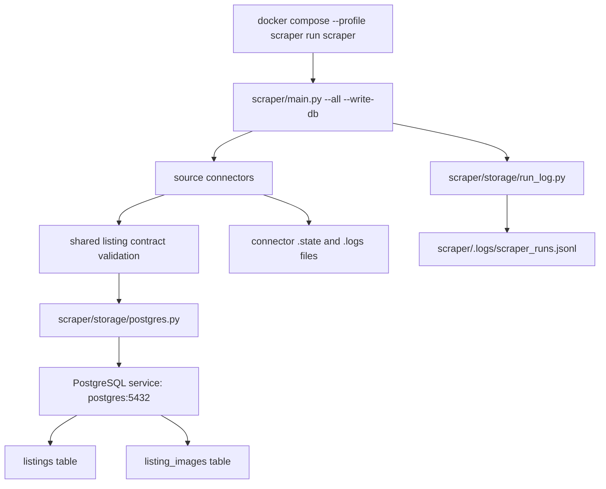

# Scraper Storage Context

This folder owns the database write boundary for the Python scraper service. It receives already-normalized and validated listing dictionaries from `scraper/main.py`; connector-specific fetching, parsing, cooldowns, and platform state stay outside this folder.

## Current Responsibility

- `postgres.py` writes normalized listings into the existing Phase 1 PostgreSQL tables: `listings` and `listing_images`.
- `run_log.py` writes scraper-side JSONL run summaries without listing payloads and redacts database passwords or secret-like keys.
- The storage layer does not own schema changes. Prisma and `prisma/schema.prisma` remain the source of truth for database schema.
- The storage layer does not store scraper config, source targets, connector health, scrape runs, parser evidence, or raw source snapshots in PostgreSQL.

## Connection Diagram

The scraper connects directly to PostgreSQL on the Docker Compose network using the service name `postgres`. It does not call the Next.js web app to ingest listings.

## Upsert Contract

1. `sourceUrl` maps to `listings.source_url` and is the idempotency anchor.
2. A new `source_url` inserts a listing row.
3. An existing `source_url` updates scraper-backed fields and `last_fetched_at`.
4. `first_fetched_at` is intentionally preserved on updates.
5. Image rows are reconciled in the same database transaction: delete current rows for the listing, then insert the latest normalized `images[]` rows.
6. All SQL uses parameterized `psycopg` calls. Do not add string-built SQL with listing values.

## Environment Rules

Database URL resolution order:

1. CLI `--database-url`
2. `SCRAPER_DATABASE_URL`
3. `DATABASE_URL`

Use `SCRAPER_DATABASE_URL` later if the scraper gets a narrower DB role than the web app. Do not log raw database URLs; use the redacted value only.

## Footnotes For Future Agents

- Keep writes opt-in. `scraper/main.py` must remain read-only unless `--write-db` is passed.
- Keep run logs scraper-side until the product explicitly needs database-backed operations history.
- Do not add `source_targets`, `scrape_runs`, or connector health tables as a side effect of storage work.
- If the Prisma schema changes, update `postgres.py` and the storage tests in the same patch.
- If image identity becomes product-visible later, revisit the delete-and-reinsert image reconciliation strategy.
